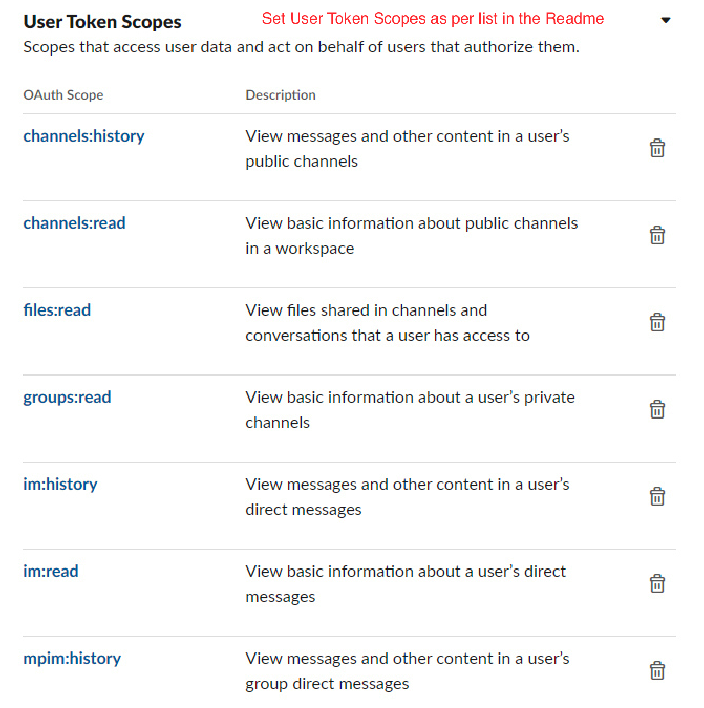
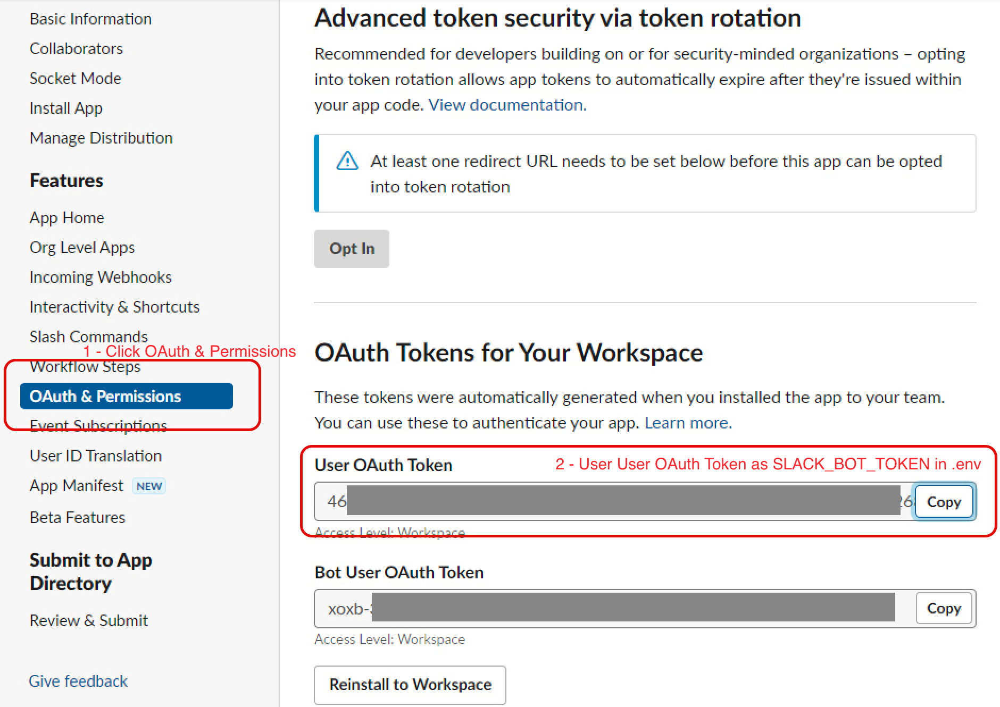
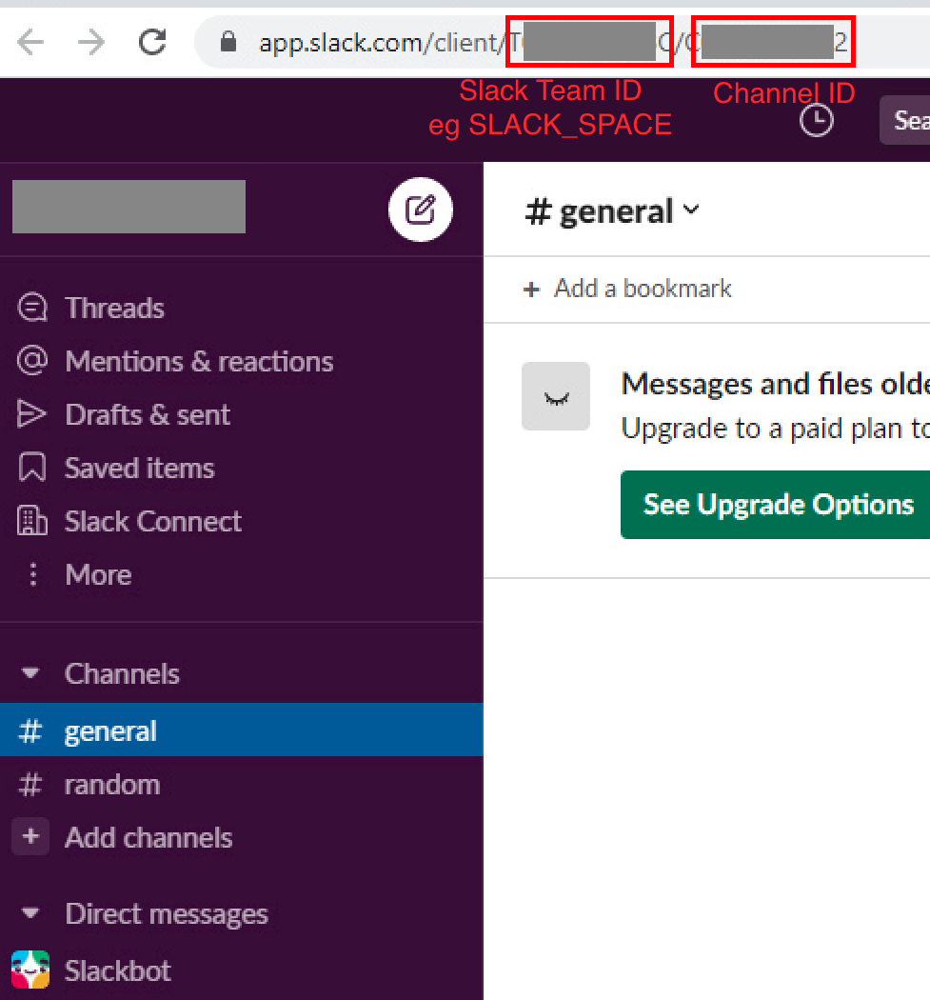

# Slack Back Static
> Download and view your slack history, channels and messages

## Overview

Slack premium is pretty expensive for something simple and opensource.
Use this to download and navigate your slack history, it will keep a record of the messages and files previously downloaded across channels and private messages.

## Usage

- Clone the repo
- Install nodejs
- Install dependences `npm i`
- Optional: Get a trial of slack premium / pay for one month to get access for entire history
- Create a slack app and deploy to your workspace. In the `OAuth & Permissions` settings, ensure you have the following `User Token Scopes`: `(see config image 1 below)`
    - channels:history
    - channels:read
    - files:read
    - groups:read
    - groups:history
    - im:history
    - im:read
    - mpim:history
    - mpim:read
    - remote_files:read
    - users:read
- Copy the `.env.example` file to `.env`
- In the slack `OAuth & Permissions` settings, get the `User OAuth Token` from the slack app and add to your `.env` file as the `SLACK_BOT_TOKEN` property `(see config image 2 below)`
- Add the slack space id (also known as, team ID) from your slack workspace and add to your `.env` file as the `SLACK_SPACE` property - Get this by opening slack in browser and looking at the URL `(see config image 3 below)`
- Optional: You can download only specific channels (and files in those channels) by including a `SLACK_CHANNELS` variable in your `.env` file. This can be a single channel id, or mutiple channel IDs separated with a comma (no space). Omitting this variable will download all channels and files. Get this by opening slack in browser and looking at the URL `(see config image 3 below)`
- Optional: If you don't want to download files (can take a while - Although, if they have been downloaded once, they won't be downloaded each time). You can surpress file downloading completely by adding `DONT_DOWNLOAD_FILES=true` to your `.env`
- Optional: Add a `STATIC_PASSWORD` property to the `.env` file if you wish to use `netlify dev` locally
- Run `npm start` or `node app.js` to begin downloading your slack messages and files
- All files added to `_static/files/*` folder. All data added to `_static/data/data.json`
- To run the slack viewer on your local machine (it is static, no server-side code or logic), run a static web server in in the `_static` directory. Eg, `npm i -g serve` and then `serve ./_static` (`npm run static` in this package.json)
- Open in your webserver - All history is stored in the hash as an SPA, all messages are indexed and searchable, as well as all files viewable and downloadable
- Optional: You can deploy to any public static server as you see fit. In this example, you can deploy to netlify by installing netlify and running `npm run deploy`. In the free version of netlify if you want a very (frail) basic security, set an environment variable for `STATIC_PASSWORD` in the console. A better alternative would be to pay for a static site with password protection. Netlify will currently allow lots of files. Any additional deploys will calculate the hashes of the files and will reduce future deployment times dramatically to a few seconds.

### Config Image 1

### Config Image 2

### Config Image 3

